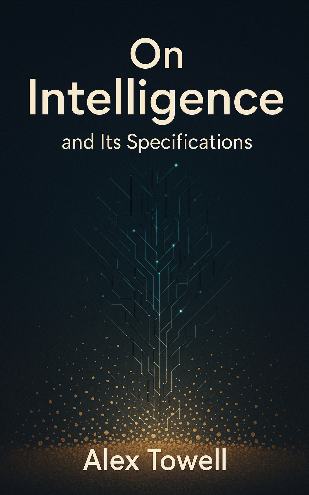

# On Intelligence and Its Specifications

*A lay-readable book on the mathematics of optimal intelligence, the specification problem, and what they imply about modern AI.*

by **Alex Towell**

We taught sand to think. We did it before we learned to say what we wanted it to do.

There is a real, settled, and genuinely beautiful theory of what intelligence is: Bayes' theorem, Solomonoff's universal prior, and expected-utility maximization, synthesized as AIXI, the optimal agent. And there are the messy, bounded systems we actually built, the large language models everyone now uses. Between the clean theory and the crude practice lies a gap, and that gap is where the safety of all of it is decided.

This book builds both halves from first principles, for the determined lay reader, and points at the gap honestly. The hardest problem turns out not to be making machines capable. It is saying what we want them to do. The specification problem is the whole game.

**Status:** Complete. 17 chapters, 4 parts, 214 pages. Paperback published via Amazon KDP (2026); Kindle edition forthcoming.

## What the book argues

The thesis runs through every chapter. There is a clean theoretical limit, AIXI, which captures what optimal agency means under standard assumptions about computation and rationality. There are bounded real systems, the LLMs of 2026, which approximate that limit. The distance between them is real, structural, and consequential. Most of what people argue about under the heading of AI safety, or alignment, is, in different vocabulary, an argument about that gap.

It is not a textbook and not a polemic. Math is used where it has to be, explained conceptually before it is formalized, with diagrams carrying as much of the work as the prose. The reader is treated as intelligent and willing to work. Closer to a Penguin science book than to a survey. No formal background is required.

## Structure

Seventeen chapters across four parts. Parts I to III develop the theory in clean settings; Part IV moves to messy practice.

| Part | Chapters | Focus |
|------|----------|-------|
| **I. Prediction** | 1 to 4 | Bayes, the prior problem, description and probability, Solomonoff induction |
| **II. Decision** | 5 to 8 | The agent, reinforcement learning, generalization, AIXI |
| **III. The Specification Problem** | 9 to 12 | Reward modeling, inner alignment, why optimization is dangerous, mitigations and their limits |
| **IV. Reality** | 13 to 17 | Large language models, reward and reasoning, the gap, what's ahead, and the finale (*Teaching Sand to Think*) |

The closing chapter takes a committed stand the mathematics earns: prediction carried far enough is intelligence; these are real minds built of sand; the prize is enormous and the danger is the same capability; the burden of proof on the trajectory has shifted.

## Reading it

- **Paperback:** published via Amazon KDP (6 x 9, 214 pages). Buy link added once the listing is live.
- **From this repository:** the build outputs are tracked, so you can read it directly.
  - [`on-intelligence.pdf`](on-intelligence.pdf), the print edition.
  - [`on-intelligence.epub`](on-intelligence.epub), the reflowable Kindle edition (math and diagrams as scalable SVG, footnotes as popups).

## Building from source

The book is written in LaTeX. The print PDF builds with `latexmk` (it reruns until cross-references and the table of contents converge). The EPUB builds with `tex4ebook`, which renders the math and the TikZ diagrams to SVG and turns footnotes into EPUB3 popup notes.

```bash
make            # build the print PDF (default)
make epub       # build the reflowable Kindle EPUB (needs tex4ebook + calibre)
make wordcount  # word count
make clean      # remove build intermediates (outputs preserved)
make help       # list all targets
```

Requirements: a TeX Live distribution (with `latexmk` and `tex4ebook`) for the PDF and EPUB, and `calibre` (`ebook-meta`) to set the EPUB cover and metadata.

## Repository layout

```
on-intelligence/
├── on-intelligence.tex      # main LaTeX file
├── chapters/                # one .tex per chapter (+ archive/ of the prior framing)
├── lore/                    # the editorial bible: outline, themes, direction, math reference
├── figures/                 # TikZ diagrams (most are inline in the chapters)
├── kdp/                     # cover assets (front + print-ready full-wrap PDF)
├── docs/                    # editorial review and integration records
├── Makefile                 # build system (PDF via latexmk, EPUB via tex4ebook)
├── CITATION.cff             # citation metadata ("Cite this repository")
└── .zenodo.json             # Zenodo DOI metadata
```

The book was restructured once. It began as a philosophical companion to the author's *Worldlines*; the technical core was the strongest part, and the new direction takes that material as its spine and points it at a concrete destination, AI safety understood mathematically. The prior framing is preserved under `chapters/archive/` and `lore/archive/`.

## In the same tradition

The book sits alongside Brian Christian's *The Alignment Problem*, Stuart Russell's *Human Compatible*, and Max Tegmark's *Our Mathematical Universe*, and it shares a structural move with the author's own *Worldlines: The Indifference of Geometry*: settled mathematics at the bottom, lived implications at the top, no hand-waving in between.

## Citation

If you reference this book, please cite it using the metadata in [`CITATION.cff`](CITATION.cff), or via the "Cite this repository" button on GitHub. Author: Alexander Towell, ORCID [0000-0001-6443-9897](https://orcid.org/0000-0001-6443-9897), Southern Illinois University Edwardsville.

## Author

Alex Towell. [lex@metafunctor.com](mailto:lex@metafunctor.com) | [metafunctor.com](https://metafunctor.com) | [@queelius](https://github.com/queelius)

## License

[CC-BY-NC-SA-4.0](LICENSE) (Creative Commons Attribution-NonCommercial-ShareAlike 4.0 International). Pedagogical adaptation is welcome with attribution.
